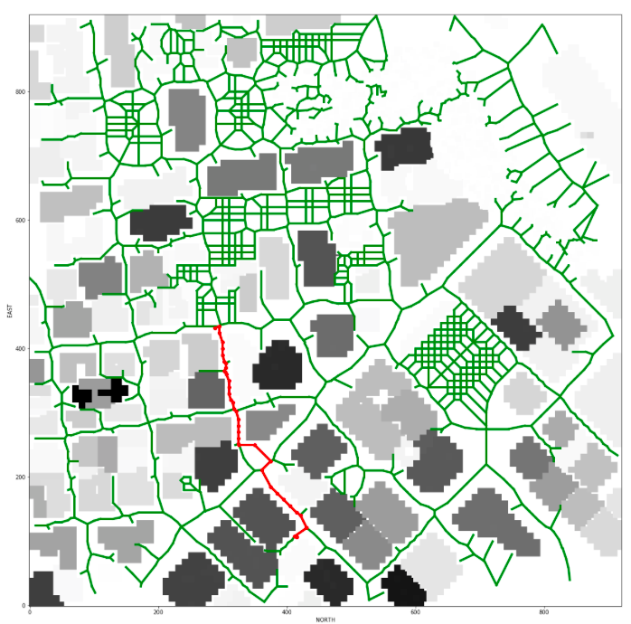
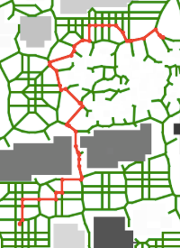
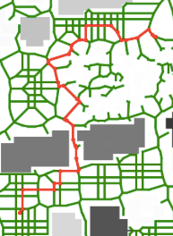
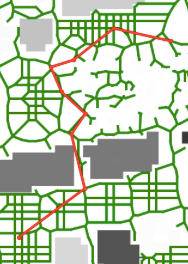

## Project: 3D Motion Planning


---
# Writeup / README
---

##[Rubric] (https://review.udacity.com/#!/rubrics/1534/view)

## In the original code

##### `planning_utils.py`:
There are four main functionalities provided in this file. <br/>
`create_grid`: takes in the 2.5D map data and converts it to a dense 2D graph (grid). <br/>
`Action`, `valid_actions`: describe legal ways (edges) to traverse through the above graph as well as the corresponding edge weight. <br/>
`a_star`: implements the standard A\* alogrithm to find a path given start, goal and graph. <br/>

##### `motion_planning.py`:
This code is based on the previous backyard flyer state machine model and customized for general tasks. The major difference includes a `plan_path` member method to plan intermediate waypoints according to map data in **colliders.csv**. The drone class will now make a flight plan after the arming state, add those waypoints to `self.waypoints` and complete the routing task with `waypoints transistion`. <br/>

## Implementing Your Path Planning Algorithm

### 1. Set global home position
I implemented a function `read_global_home` to read in the **colliders.csv** file and parse the first line using pre-built python string functions to get floating point values of the longitude and latitude of the home position.<br/>

### 2. Set local position
With help of `global_to_local` function in `frame_utils.py`, we can easily extract any location in local ECEF format given their geodetic coordinates.<br/>

```python
current_pos = global_to_local(self.global_position, self.global_home)
start = global_to_local(global_start, self.global_home)
goal = global_to_local(global_goal, self.global_home)
```

### 3-6. More flexible and Advanced path planning algorithm
To deal with different algorithms mentioned in class, I wrapped my code into three main classes, i.e. `Planner`, `Map_graph`, `A_star`. I will explain my code and address rubric point 3-6 together in this section. <br/>

#### My implementation

##### `Map_graph`
A base class of map-graph. The map graph should be derived from **colliders.csv** and will be passed to `A_star` to apply A\* path planning algorithm. The map-graph provides a member method `next_node`, which takes in one node in the graph and return all the valid neighbor nodes and corresponding traversing cost. <br/>

##### `A_star`
This class is a more flexible version of the original `a_star` fucntion. It now takes a start, goal and `Map_graph` object and will either return a valid path or an empty list. In general, this class is ready for all kinds of graph-based A\* algorithms if an appropriate `Map_graph` object is provided. <br/>

##### `Planner`
`Planner` objects require a `Map_graph`, pruning method , start GPS, goal GPS, and some parameters such as drone flying altitude and safty distance to fully operate. There are currently two kinds of `Map_graph` and three kinds of pruning method provided in this project. When the above input argument specified approperiately, the planner will either return a valid path from start to goal or raise `ValueError` if no legal path is found. `Planner` has a high-level interface so that it can be easily used with drone class. <br/>

```python
# Setup Planner
planner = Planner("colliders.csv",
                  raw=Plan.VORONOI,
                  local=Plan.SIMPLE,
                  drone_alt=5,
                  safe_dist=3,
                  prune_raw=False,
                  greedy_prune=False,
                  verbose=False)

# plan path from start to goal
planner.plan_path(start, goal)

# get waypoints at once
raw_path = planner.raw_waypoints

# pop waypoints one-by-one
# which is served for more sophisticated local path refinement algorithm
path = []
while True:
    points = planner.get_waypoints()
    if points == []:
        break
    path.extend(points)

# visualize 2d graph
planner.viz_path(
    path,
    graph=None,
    draw_graph=True,
    draw_line=True,
    draw_points=True,
    draw_end_points=True,
    grid_binary=False,
    grid_alt_offset=True)
```

##### `MotionPlanning`
Due to above implementations, the original drone class `MotionPlanning` is modified accordingly. The new class `MotionPlanning` now has a `Planner` object member and will access waypoints with `Planner`'s interface. <br/> 


#### Rubric points 3-6
The rubric points 3-6 will be explained in details in the following subsections. <br/>

##### 3. Set start/goal on graph. 
The `Planner` object has a pair of mapping functions called `NEAH_to_grid` and `grid_to_NEAH`, which are respond for conversion between the local ECEF frame and the class internal 2.5D grid coordinates. This conversion is simply offsetting origin to the most western and southern point in the **colliders.csv** file. After converting to internal grid coordinates, a `Map_graph` object could then mark corresponding start, goal node on its graph.

##### 4. A\* search on Voronoi graph 
The complexity of A\* algorithm is bounded by **O(b<sup>d</sup>)**, where b is the branching factor and d is the depth of shortest path.Therefore, grid-based graph is too dense in such sense. To improve its efficiency, we can reduce the nodes and average edges attached to a node. I choose to build a Voronoi graph based on the center of obstacles and remove illegal nodes and edges. Below is an example of the search on the Voronoi graph. <br/>



The resulting Voronoi graph is obviously a more efficient representation than grid. Some analysis of the differences between two graph are listed in **Table 1**. However the meshes shown in the image still cause some redundancy for the graph. One could further improve the efficiency by eliminating such structure in graph. <br/>

##### **Table 1. graph comparison** 

     graph    |   grid  |   Voronoi 
:------------:|:-------:|:-----------:
     \|V\|    |   850k  |    1.7k 
     \|E\|    |   3.4M  |     2k
branch factor |   3.99  |    1.18 


##### 5. Cull waypoints.
In this section, I will summarize three kinds of pruning method I choose to use in this project. <br/>

###### a. Check inline with determinant (det pruning)
If the determinant of a waypoint and its neighbors is below certain threshold value, remove the waypoint. 

###### b. Check inline greedily with Bresenham algorithm (greedy pruning)
Try to skip waypoints aggressively and check if it's valid with Bresenham algorithm. <br/>

```python
new_path = []
new_path.append(path[0])
idx = 2
while idx < len(path):
    last = new_path[-1]
    cand = path[idx-1]
    p = path[idx]
    
    # check if a direct line through last & p will result in collision
    is_bump = ... # check with bresenham algorithm
    if not is_bump:
        idx += 1 # skip this waypoint
    else:
        new_path.append(cand)
        idx += 1
    
    # add goal point if it's not include
    if new_path[-1] != path[-1]:
        new_path.append(path[-1])
```
###### c. Comparisons
It can be shown that greedy pruning outperform other methods, and the route isn't neccessarily composed of Voronoi graph edges. In this sense, greedy pruning can generate a legal path with minimum waypoints given the graph. <br/>

##### **Table 1. Pruning comparison** 

method |without pruning | det pruning | greedy pruning
:-----:|:--------------:|:-----------:|:-------------:
number |  47 waypoints  |40 waypoints |  9 waypoints
complexity |    O(1)    |     O(d)    |    O(d\*L)
figure |  |  | 

The major drawback of greedy pruning is its time complexity. A rough upper bound would be **O(d\*L)**, where d is the depth of a path and L is the larger value in the shape of 2.5D grid. Luckily, this overhead is negligible with A\* algorithm. To demonstrate this, I randomly sampled 20 different (start, goal) in the city, and search a path using `Planner` with various setting. The result is summarized in **Table 2**. <br/>

##### **Table 2. Voronoi graph planning comparison**

Method | without pruning | det pruning | greedy pruning
:-----:|:---------------:|:-----------:|:-------------:
number| 51.9 waypoints | 43.0 waypoints | 5.6 waypoints 
distance| 634.35 m | 633.74 m | 443.46 m 
time cost| 0.80 s | 0.75 s | 0.77 s

## Execute the flight
### 1. Does it work?
It works! Below is a demo flying video. <br/>

[]
(https://www.youtube.com/watch?v=cvZjo8JO4pM&feature=youtu.be)


